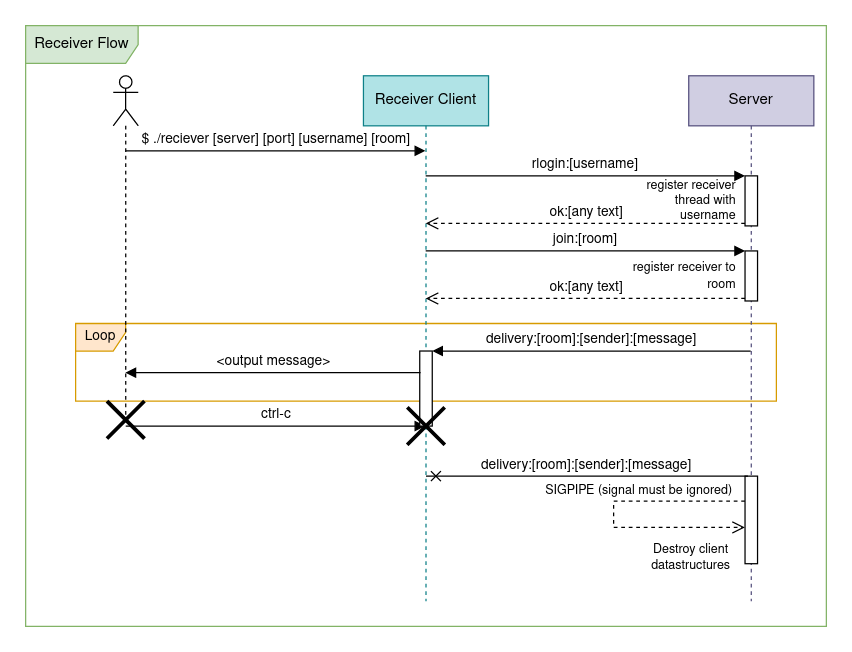
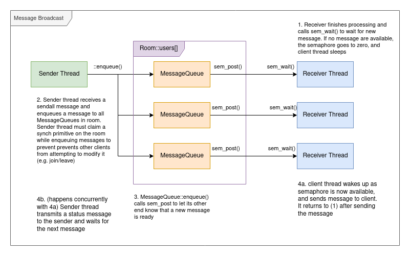

*Note*: Assignment 5 is a double assignment. Each milestone (MS1 and MS2)
is worth 1/6 of the assignments grade for the course, equal to
(individually) Assignments 1–4.

**Due:**

* Milestone 1 due **Wednesday, Apr 20th** by 11pm
* Milestone 2 due **Friday, Apr 29th** by 11pm

*Update 4/13*: Adjust weights so that MS1 and MS2 are equal

*Update 4/14*: Added [Demo recording](#demo), [Automated testing support](#automated-testing),
and updated the skeleton project ([csf\_assign05.zip](csf_assign05.zip)) to fix an
issue with the reference server implementation (`ref-server`).
If you've already started working on the assignment,
you can update your reference server by running the following commands
in your project directory (make sure you've committed and pushed
all of your work first, just to be safe):

```
wget https://jhucsf.github.io/spring2022/assign/csf_assign05.zip
unzip csf_assign05.zip csf_assign05/reference/ref-server
mv csf_assign05/reference/ref-server reference
chmod a+x reference/ref-server
rm csf_assign05.zip
rm -r csf_assign05
```

*Update 4/16*: There was an error in the `solution.zip` target of the `Makefile`
in the original project skeleton.  To fix it, change the `zip` command from

```
zip -9r $@ Makefile *.cpp *.c README.txt
```

to

```
zip -9r $@ Makefile *.cpp *.c *.h README.txt
```

# Overview

In this assignment, you will develop a chat client program that communicates
synchronously with a server in real-time. You may think of this as an
implementation inspired by classical chat systems such as IRC.

You can get started by downloading and unzipping [csf\_assign05.zip](csf_assign05.zip).

**Note:** We highly recommend that you use C++ for this assignment. The server is
easier to write with abstractions such as scoped locks and classes. It is also
very useful to use C++ classes to represent important objects in the client
and server implementations, such as `Connection` and `Message`.
The provided skeleton code includes partially implemented classes which
we encourage you to use as the basis for your client and server implementations.

## Grading Criteria

Milestone 1:

* Implementation of sender client: 22.5%
* Implementation of receiver client 22.5%
* Design and coding style: 5%

Milesone 2:

* Implementation of server: 30%
* Report explaining thread synchronization in server: 15%
* Design and coding style: 5%

## Goals of the assignment

The main goal of the assignment is to provide an opportunity to create a
network application.

Although this will be a relatively simple program, it is representative of a
larger class of network-enabled systems:

* It will have a protocol for communication between clients and server
* it will allow communication over a network (specifically by accepting TCP
    connections from clients)
* It will use concurrency and synchronization primitives to coordinate access to
    shared data on a remote server

## Demo

Here is an example chat session with three different senders and one receiver, all
connected to the same server:

<!-- Widget loads here -->
<div id="demo-widget"></div>

(thanks [asciinema](https://asciinema.org/) for the wonderful terminal recording
widget!)

<!-- Load the Asciinema Widget -->
<script src="{{site.baseurl}}/js/asciinema-player.min.js"></script>
<link rel="stylesheet" type="text/css" href="{{site.baseurl}}/css/asciinema-player.css">
<script>
  AsciinemaPlayer.create('assign05/session.cast', document.getElementById('demo-widget'), {
  speed: 2,
  idleTimeLimit: 2,
  poster: 'npt:0:32'
  });
</script>

## The Protocol

The client and server communicate by exchanging a series of _messages_ over a
TCP connection. There are two kinds of clients: a _receiver_ which is used to
only read messages from the server, and a _sender_ that is used to send messages
to the server. To allow multiple groups of people to talk independently, the
server partitions clients into "rooms". All receivers in the same room
will receive that same set of message, and all senders in the same room will
broadcast to the same receivers.

A _message_ is an ASCII-encoded transmission with the following format:

```
tag:payload
```

A _message_ is subject to the following restrictions:

* A message must be a single line of text with no newline characters contained within
    it.
* A message ends at a newline terminator which can be either `"\n"` or `"\r\n"`.
    Your programs must be able to accept both of these as newline delimiters.
* The `tag` must be one of the operations specified in the "tag
    table".
* The payload is an arbitrary sequence of characters. If a tag has a structured
    payload, the payload must be formatted exactly as specified.
* If a tag has a payload that is ignored (e.g., the "quit" and "leave" tags),
  the tag/payload seperator character `:` must still be present (e.g. `quit:` not `quit`),
  even if the payload is empty
* An encoded message must not be more than `MAX_LENGTH` bytes.

The first message sent to the server by a client is considered a login message,
and must have one of the following tags:

* `slogin`
* `rlogin`

These commands allow the client to log in to the server with the specified
usernames. `slogin` is for a sender, and `rlogin` is for a receiver. A receiver
terminates its connection by simply closing its socket. The server will
automatically detect when this happens by looking a send failure on the next
message sent to the client.

If a client logs in with `slogin`, from that point forwards, it is a synchronous
protocol. The client sends a message, and the server sends a response,
indicating the status of the request.

The following message types are defined:

Tag | Sent by | Payload content/format | Description 
----|--------|------------------------|-------------
err | server | message\_text | client's request was not carried out.
ok | server | message\_text | client's request ran to completion.
delivery | server | room:sender:message\_text | a delivery of a received message to a receiver.
slogin | sender | username | log in as sender.
rlogin | receiver | username | log in as receiver.
join | sender/receiver | room\_name | client wants to join specified room (which will be created as necessary). Client leaves the current room if applicable.
leave | sender | [ignored] | the sender sends this command to leave the chat room they are currently in
sendall | sender | message\_text | send a message to all users in room
quit | sender | [ignored] | client is done, server will close the connection.

You may have the following assumptions about the usernames and room
names we test your programs on:

* They will be at least one character in length
* They will contain only letters (`a`-`z` or `A`-`Z`) or digits (`0`-`9`)

The reference server implementation will reject operations in which the username
and/or room name do not meet these criteria.

## Assignment skeleton

We have included a reasonably comprehensive assignment skeleton in the starter
code to help you factor your design into manageable parts. You are free to change
any part of the design, up to and including writing your assignment from
scratch, so long as your program follows all semantics of the reference
executables.

If you elect to change the skeleton code or the Makefile, ensure
that you build executables with the sames names as the ones our Makefile builds.
Do be especially careful if you elect to change our synchronization plans to
prevent accidentally introducing sync hazards.

Here is a description of the files included in the starter code:

* `client_util.{h,cpp}` - contain utility functions that are shared between the
    send client and receive client.
* `connection.{h,cpp}` - class describing a connection between a client and
    server. Used by both the receiver, the sender, and the server.
* `csapp.{h,c}` - functions from the CS:APP3e book. You are free to modify
    functions here as needed, e.g. adding const qualifiers for const
    correctness, but be careful if you don't completely understand the function
    you're changing!
* `guard.h` - RAII style block-scoped lock. Creating the object aquires the
    lock, destroying the object (i.e. when it goes out of scope) releases the
    lock.
* `message.h` - class representing the protocol message format.
* `receiver.cpp` - contains the main function for the receiver.
* `room.{cpp,h}` - room class used by the server.
* `sender.cpp` - contains the main function used by the sender.
* `server.{cpp,h}` - server class that tracks and aggregates the entire chat
    server's state. Highly recommended that you follow the sketch presented here.
* `server_main.cpp` - Contains the main function for the server. If you
    implement `server.cpp` correctly above, you should not need to make changes
    to this file.

## Milestone 1: The clients

For the first part of this assignment, you will be responsible for implementing
the _receiver_ and the _sender_ to communicate with a server binary included in
the starter code. Note that the following messages are considered unused and do
not need to be handled by any client:

* `senduser`

### Receiver

The receiver will be run in the following manner from the terminal:

```
./receiver [server_address] [port] [username] [room]
```

The receiver must send the `rlogin` message as its first message to the server.
The following communication flow has been provided for your reference (note that
this only covers the "happy case"):



The receiver should print received messages in the following format to stdout:

```
[username of sender]: [message text]
```

The following messages must be handled:

* `rlogin`
* `join`
* `delivery`
* `ok`
* `err`

If the server returns `err` for either the `rlogin` or `join` message, the
receiver must print the payload to `stderr`/`cerr` and exit with a
non-zero exit code. The receiver does not need to exit cleanly, we expect it to
terminate it by sending it a `SIGINT` (a.k.a. `<ctrl>+c`).

### Sender

The sender will be run in the following manner from the terminal


```
./sender [server_address] [port] [username]
```

The sender must send the `slogin` message as its first message to the server.
The following communication flow has been provided for your reference (note that
this only covers the "happy case"):


The following messages must be handled:

* `rlogin`
* `join`
* `sendall`
* `leave`
* `ok`
* `err`

After the sender logs into the server, it should read `stdin` for messages and
commands. Commands start with the `/` character and may be one of the following:

* `/join [room name]` - joins the specified room on the server using a `join`
    message
* `/leave` - leaves the current room, stopping all message delivery using a
    `leave` message.
* `/quit` - Instructs the server to disconnect the current send client using a
    `quit` message.
* All other commands should be rejected with an error message printed to
    `stderr`/`cerr`

You may assume that all command arguments are valid if the command matches a
recognized command.

The client must listen for a response from the server after sending each message
(synchronous protocol). It is okay to stop reading user input during this time.
If the server returns `err` for the `slogin` request, the sender should print
the payload to `stderr`/`cerr` and exit with a non-zero exit code. If the
server returns `err` for any other request, the sender should print the payload
to `stderr`/`cerr` and continue processing user input.

If the `quit` commend is issued, the sender must wait for a reply from the
server before exiting with exit code 0.

### Error Handling

The following diagram summarizes how errors should be handled:


Each error message must be exactly one line of text printed to `stderr`/`cerr`. The
error text printed must be exactly the payload returned from the server in the
`err` message for server-side error. You may assume that this payload will
always be correctly formatted. For client-side errors, you may choose any error
string you want so long as it follows the specifications above and is suitably
descriptive.

You must handle failures to open the TCP communication socket by printing an
informative error message and exiting with a non-zero exit code. You may assume
that the server will stay online for the entire duration of the chat session.

If a client to run with the incorrect number of arguments, a descriptive usage
message should be printed to `stderr` indicating how the program should be invoked.

### Implementation Tips

You are free to use any functions in the provided `csapp.h` header. In
particular, we recommend that you use the `rio_*` family of functions for writing
to the TCP socket file descriptors instead of using the raw syscalls. TCP
connections have significant latency that requires read to be buffered correctly
for expected behaviour. Remember that `rio_readlineb` does not strip the
newline characters.

To open the client connection to the server, we recommend using the
`int open_clientfd(char* hostname, char* port)` function. This function accepts
a hostname (server address) as a string and the desired port as a string, and
returns a file descriptor that is ready for use with the `rio_*` family of
function.

### Testing

To aid your testing your program, we have provided a sample server implementation as a
Linux binary in the starter code (see the [Reference implementation](#reference-implementation)
section below.) We have intentionally compiled it without
debugging information and stripped it of any symbols. If your clients are
implemented correctly, you should be able to type in a message and see the
message appear on all read clients in the same chat-room. You may run our
server binary using the following command:

```
./reference/ref-server [port number]
```

We have only tested the binary on the Ugrad systems, and do not guarantee that it
will work anywhere else. It definitely will not work on Mac computers, but may
work on certain versions of WSL2.

Where `[port number]` is any integer greater than 1024. If the server fails to
open on the given port, try another one. You must specify the same port between
the clients and server.

You can also test one client at a time by using netcat as follows:

```
nc localhost [portnumber]
```

You can then pretend to be a receiver by sending a `rlogin` request:

```
rlogin:alice
join:cafe
sendall:Message for everyone!
```

Or you can pretend to be a sender by sending a `slogin` request:

```
slogin:bob
join:cafe
<messages will appear here as they are sent to the room "cafe">
```

Do not valgrind `netcat` as that will not be testing your program, and may
generate false positives. Instead you should only valgrind the client excutables
that you write.

#### Automated testing

You can obtain the automated test scripts here:

* [test_receiver.sh](assign05/test_receiver.sh)
* [test_sender.sh](assign05/test_sender.sh)

You can download them on the in the terminal by using `wget [link]` while you
are in the same directory your project is in. Don't forget to make them
executable after downloading them using `chmod u+x [file]`.

`test_receiver.sh` is invoked as follows:

```
./test_receiver.sh [port] [sender_client] [room] [server_in_file] [output_stem]
```

and `test_sender.sh` is invoked as follows:

```
./test_sender.sh [port] [sender_client] [client_in_file] [server_in_file] [output_stem]
```

Note that `test_sender.sh` exits with the exit code the client exited with, so you
can verify that your client exited with the correct exit code by running `echo
$?` **immediately** after running the test script.

The arguments are:
* `port` - port to run server on. Pick anything above 1024
* `*_client` - name of the client binary to run. 
* `room` - room to connect the sender to
* `server_in_file` - file containing list of messages server should send, one
    message per line
* `client_in_file` - file containing list of user inputs to the client, one per line.
* `output_stem` - base filename for the output, the files
    `[output_stem]-received.out`, `[output_stem]-client.out`,
    `[output_stem]-client.err` will be created which correspond to the messages
    sent by the client to the server, the output the client printed to `stdout`, and the
    output the client printed to `stderr` respectively.

While we highly encourage you to come up with your own test inputs, we have
provided the following test inputs for reference:

* [test_receiver_server.in](assign05/test_receiver_server.in)
* [test_sender_server.in](assign05/test_sender_server.in)
* [test_sender_client.in](assign05/test_sender_client.in)

You can run the example receiver test using:

```
./test_receiver.sh 12345 receiver partytime test_receiver_server.in receiver_test
```

and you should verify that `receiver_test-client.err` is empty, that
`receiver_test-client.out` contains exactly:

```
bob: hi alice
robert_de_bobert: I have the cookies.
bob: cookies?

```

and that `receiver_test-received` contains exactly:

```
rlogin:alice
join:partytime

```

You can run the example sender test using:

```
./test_sender.sh 12346 sender test_sender_client.in test_sender_server.in sender_test
```

and you should verify that `sender_test-client.err` is empty, and that
`sender_test-received` contains exactly:

```
slogin:alice
join:partytime
sendall:Hello World!
join:cafe
sendall:get me 1 coffee
quit:bye

```

With the exception of the payload to `quit` (it can be any text).

## Milestone 2: The server

For this part of the assignment, you will be responsible for implementing the
_server_. The server is responsible for accepting messages from _senders_ and
broadcasting them to all _receivers_ in the same room.

The server will be run in the following manner from the terminal:

```
./server [port]
```

where `[port]` specifies the port that the server should listen on.

### Tasks

Your overall tasks are to:

* Create a thread for each client connection. You will need a datastructure to
    represent the data associated with each client. We recommend that you use the same
    `Connection` class you used in part 1 to represent these connections. You
    may use the login message to determine what kind of client is tryiung to
    connect.
* Process _control messages_ from clients.
* Broadcast messages to all receivers in a room when a sender sends a message.
* Add synchronization for access to share data structures (`Room`s, `Server`) so
    no messages are lost, even if a receiver leaves or tries to join in the middle of a
    broadcast. You also must not lose messages that are sent at the same time
    from two different senders.

### Using threads for client connections

In general, it makes sense for server applications to handle connections from
multiple clients simultaneously, as servers are typically responsible for
coordinating data exchanges. Threads are a useful mechanism for handling
multiple client connections because they allow the code that communicates with
each client to run concurrently.

In your main server loop (`Server::handle_client_requests()` if you are following
our scaffolding), you should create a thread for each accepted client
connection. Use `pthread_create()` to create the client threads. You will
probably want to create a struct to pass the `Connection` object and other
required data to the client thread, and user `worker()` as the entrypoint for
the thread. It may also be a good idea to create `User` object in each client
thread to track the pending messages, and register it to a `Room` when the
client sends a join request.

You can test that your server handles more than one connection correctly by
spawning multiple receivers and senders connecting to the same server, and
checking that the messages sent from all receivers get correctly delivered to
all senders.

### Receiver and sender loops

If you are following our skeleton, we recommend that you separate the
communication loops for the senders and receivers into the `chat_with_sender()`
and `chat_with_receiver()` functions respectively. Please refer to the flow
diagrams in Part 1 to determine how you should implement these loops.

We have already handled the `SIGPIPE` signal for you in our provided server main
function, so you should be able to detect partial reads by matching the return
value of `rio_*` against the size of the message transmitted. If they do not
match, you may assume that a transmission error has occurred and handle
accordingly.

For all synchronous messages, you must ensure that the server always transmits
some kind of response (`err` for error, `ok` for success) to receive full
credit. **Important**: You must ensure that you skip sending a message to a
client with the same username as the sender of a message. For example, if Alice
sends a message, all receivers logged in as Alice must not receive that
message.

In the receiver client loop, you must terminate the loop and tear down the client
thread if any message transmission fails, or if a valid `quit` message is
received. For the sender client loop, you must terminate the loop and tear down
the client thread if any message fails to send, as there is no other way to
detect a client disconnect. Be sure that you clean up any datastructures and
entries specific to the client before terminating the thread to prevent memory
leaks.

### Broadcasting messages to receivers

To make synchronization easier, we recommend that you implement the pub/sub
pattern, using the `MessageQueue` class we outlined for you. In this pattern, a
sending thread interates through all the `User`s in a room and pushes a message
into each `MessageQueue`. This event wakes up the receiver thread, allowing it
to dequeue the messages at its leisure. Here is a diagram of how this could
work:



Queues are a useful paradigm here because they allow us to receive messages at
a different rate than we send them. If we had to wait for all messages to finish
sending before releasing the lock on the room, we could end up spending all of
our time servicing send requests, which would bring the server to a standstill.

To implement this "notification" behaviour, we recommend that you use a
combination of a semaphore and a lock. The lock ensures that the message queue
can only be modified by one thread at a time, and the semaphore is used to
"notify" the other end that a new message is available. Recall that a semaphore
blocks a thread when it goes below zero, and can be incremented (`sem_post`) and
decremented (`sem_wait`, `sem_timedwait`) from different threads. Thus, we can
essentially use the semaphore in each `MessageQueue` as a sort of "smart"
counter of the available messages in the queue. This implements the correct
behaviour: if there are no messages available, we want the receiver to sleep until
there are available message, and each time a message is sent, it reduces the
available messages by one.

The sender client thread may return a response to the sender as soon as the
message is done being added to all MessageQueues. It does not need to wait until
the message has actually been delivered to all of the receivers in the room, but
it should not return a status until the message is done being enqueued.

Note: While we recommend `sem_timedwait()` in the starter code, `sem_wait()` is
also acceptable for simplicity.  (Using `sem_timedwait()` has the advantage
that the thread handling a connection with a receiver will not be blocked
indefinitely if there are no messages waiting to be delivered to that receiver.)

### Synchronizing shared data

Synchronization is typically necessary when multiple threads can attempt to
access the same data at the same time. Synchronization may also be necessary if
certain semantics are desired of accessed to shared data (e.g. guaranteed
ordering).

Strictly speaking, if the data type is _atomic_, read accesses need not be
synchronized so long as they can provably never occur at the same time as a
write. However, for this assignment, we are not using _atomic types_, so you
will need to synchronize _all_ concurrent access.

The section of code where synchronized access to data is implemented is called a
"critical section", and should be limited in length as concurrency is greatly
restricted in these sections. Making critical sections too long can potentially
cripple performance in real-world applications.

Add synchronization to the `Server`, `MessageQueue`, and `Room` objects to
ensure that updates to these objects will never be lost, not matter how the
objects are accessed. For example, if multiple clients try connect to the server
at the same time, both clients must be registered correctly, without losing
either one. Likewise, if two clients try join a room or send a chat at the
same time, both requests must be successfully carried out, with neither
operation "lost" or partially completed.

In a more practical sense, you may want to introduce a mutex to the `Server`,
`Room` and `MessageQueue` objects, and then add critical section(s) where needed
to ensure that the synchronization requirements are met. **Very important**: You
should not allow critical sections to be accessed across object boundaries to
prevent synchronization bugs. For example, if you implement a mutex in the
`Room` class, you should make it private and only synchronize to it from `Room`
methods.

Consider your synchronization hazards carefully! There are a few cases that may
cause data races that are not immediately obvious (e.g. you must ensure that
clients never broadcast and join/leave the room at the same time to prevent
races).

#### Guard locks

To help prevent you from introducing deadlocks, we have provided a "block scoped
lock" implementing the "Resource Acquisition Is Initialization" (RAII) pattern
in `guard.h`. This means that constructing the `Guard` object tries to claim the
lock, and allowing it to go out of scope releases the lock. If you need the lock
to be held for a shorter scope than the entire enclosing block, you can
introduce additional scoped blocks:

```
void foo(pthread_mutex_t *lock) {
    ...
    // introduce new block scope
    {
        // Aquire lock, blocks thread until lock becomes available
        Guard(*lock);
        // do something with the lock held
        // invariant upheld: only one thread may enter this section at a time.
        ...
    }
    // lock is RELEASED here, and threads will be concurrent
    ...
}
```

We **highly recommend** that you use `Guard` objects instead of raw calls to
`pthread_mutex_lock()` and `pthread_mutex_unlock()`, as the block scoping
ensures that you will never forget to release the lock, preventing a vast class
of possible deadlocks. Remember that `pthread_mutex_init` must be called exactly
once on each mutex before it can be used.

#### Synchronization report

Since synchronization is an important part of this assignment, we'd like you to
support a report on your synchronization in your README.txt. Please include where
your critical sections are, how you determined them, and why you chose the
synchronization primitives for each section. You should also explain how your
critical sections ensure that the synchronization requires are met without
introducing synchronization hazards (e.g. race conditions and deadlocks).

### Error Handling

If the server fails to bind the listen TCP socket for any reason on the host,
you must print a descriptive error message to `stderr` and return a non-zero
return code. Once the server binds the port and starts listing for clients, it
does not need to handle actually shutting down.

We expect your server to be _robust_. This means no matter what any client
sends, in any order, your server should not crash. Note that to ensure this is
the case, you probably will want to use the `rio_*` functions, and the
`Connection` class you implemented for the clients. Some (non-exhaustive)
examples of bad things the client may do that _should not_ crash your server
include:

* Sending messages longer than `Message::MAX_LEN`
* Sending invalid messages that cannot be parsed, including empty messages.
* Sending messages with invalid tags.
* Leaving and joining at any point in the communications sequence.
* Attempting to send a response to a client that has dropped off between the
    time a message was sent and before it could accept its response.

If a message cannot be parsed, could not be carried out, or is not a valid
message, you must send an `err` message to the client with a descriptive
payload. If a sender tries to send a message or leave a room while it is not in
a room, you must also return `err` with a suitable payload. This _should not_
stop the server, nor disconnect the client. Otherwise, you _must_ send an `ok`
message with suitable payload. Failure to send a response to a client operating
in synchronous mode at any time one is expected is a _severe_ bug that will
cause most tests to fail.

All client data should be cleaned up as soon as the server detects that the
client connection has died. You may assume that any transmission error indicates
that a client has died. It is okay if receivers are not cleaned up until the
next broadcast is sent to a room for ease of implementation.

Since your server has no way of shutting down, you may ignore the "in-use at
exit" portion of valgrind. You should still fix any leaks (section marked
"definitely lost"), and invalid reads, writes, and conditional jumps

### Implementation tips

Start early! There are quite a few things you will need to think through in
order to create a submission that receives full credit. We recommend that you
start by implementing the logic that waits for new client connections and spawns
client threads to handle them. If you are struggling with synchronization, we
recommend that you reach a basic implementation without them, which might help
you identify critical sections.

We recommend that you use _detached threads_. This means that you will not have
to join them back to the primary thread, and that you do not ahve to save the
`pthread_t`from `pthread_create()`. There are two safe ways to do this.
This first is to initialize a `pthread_attr_t` struct with the correct flags
using `pthread_attr_setdetachedstate()`, and pass this into the relevant
argument for `pthread_create()`. The second is to call
`pthread_detach(pthread_self())` from the child thread. Under no circumstances
should you attempt to detach the thread from the creating thread as that risks a
data race.

Don't forget to initialize your synchronization primitives before use. For
`pthread_mutex_t`s this is `pthread_mutex_init()`. For semaphores, this is
`sem_init()`. Use of synchronization primitives before they are initialized is
undefined behaviour and may not impose synchronization semantics as you expect
them to be applied. You should also destroy your synchronization primitives when
you release their associated resources. Failure to call the destruction
functions may result in leaked memory.

Do not attempt to share stack-allocated data between threads. This is undefined
behaviour and generally causes the strangest bugs. Instead, ensure that any data
that must be accessed between threads is part of a heap-allocation.

We also recommend using scope to your advantage. RAII resources such as the
provided `Guard` type prevent you from making mistakes like forgetting to release
resources, and defining variables to the narrowest scopes they will function in
dramatically reduces the potential for subtle bugs to creep their way into your
program. Aim to fail fast and early on coding mistakes.

If the server appears to become unresponsive for a long period of time it has
probably deadlocked, and you will need to examine your synchronization. If a
server doesn't bind a socket on a given port, try another one, as the port you are
trying to bind may be already taken.

### Testing

Here are some automated tests you can try:

**Coming soon!**

## Reference implementation

In the `reference` directory of the project skeleton, you will find executables
called `ref-server`, `ref-sender`, and `ref-receiver`. As the names suggest, these
are the reference implementations of the server, sender, and receiver. Your
`server`, `sender`, and `receiver` executables should be functionally
equivalent.

Here is a suggested test scenario.  You will need three terminal sessions.

In terminal number 1, run the server (user input in **bold**):

<div class="highlighter-rouge">
<pre>
$ <b>./ref-server 47374</b>
</pre>
</div>

You can use any port number 1024 or above instead of 47374.

In terminal number 2, run the receiver (user input in **bold**):

<div class="highlighter-rouge">
<pre>
$ <b>./ref-receiver localhost 47374 alice cafe</b>
</pre>
</div>

Make sure you use the same port that you used in the `server` command.

In terminal number 3, run the sender (user input in **bold**):

<div class="highlighter-rouge">
<pre>
$ <b>./ref-sender localhost 47374 bob</b>
<b>/join cafe</b>
<b>hey everybody!</b>
<b>/quit</b>
</pre>
</div>

In terminal number 2 (where the receiver is running, you should see the following output):

```
bob: hey everybody!
```

Note that while the `ref-sender` program will terminate when the `/quit` command
is executed, the `ref-server` and `ref-receiver` programs will need to be
terminated using Control-C.

## Submitting

You can use the `solution.zip` target in the provided `Makefile` to create a zipfile
you can submit to Gradescope:

```
make solution.zip
```

Upload your `solution.zip` as **Assignment 5 MS1** or **Assignment 5 MS2**,
depending on which milestone you are submitting.

Make sure your Milestone 2 submission includes your `README.txt` describing
your approach to thread synchronization in the server.
