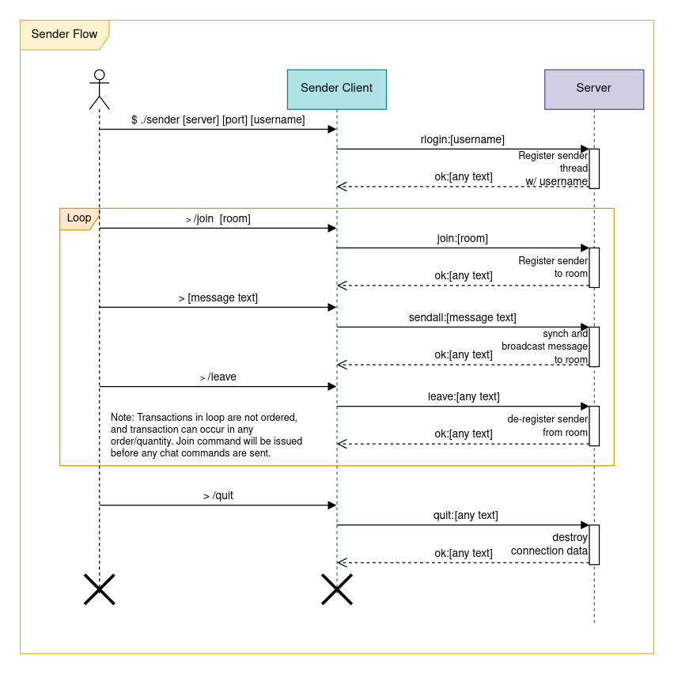
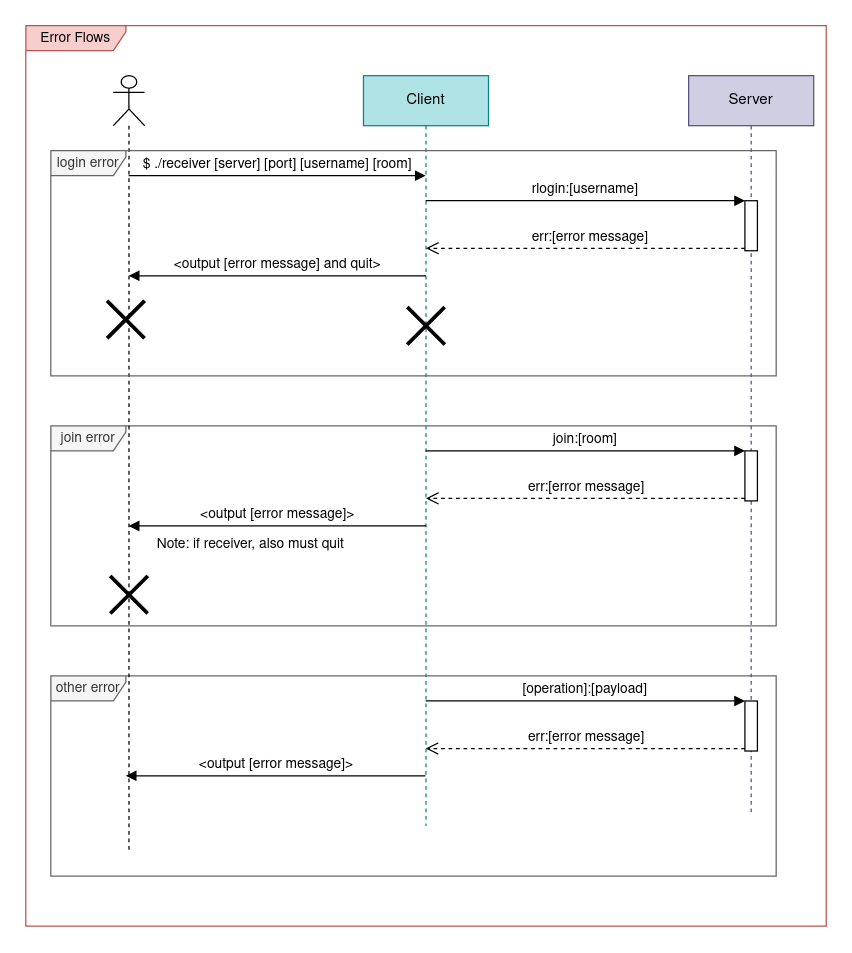

*Note*: Assignment 5 is a double assignment. Each milestone (MS1 and MS2)
is worth 1/6 of the assignments grade for the course, equal to
(individually) Assignments 1–4.

**Due:**

* Milestone 1 due **Wednesday, Apr 20th** by 11pm
* Milestone 2 due **Friday, Apr 29th** by 11pm

*Update 4/13*: Adjust weights so that MS1 and MS2 are equal

# Overview

In this assignment, you will develop a chat client program that communicates
synchronously with a server in real-time. You may think of this as an
implementation inspired by classical chat systems such as IRC.

You can get started by downloading and unzipping [csf\_assign05.zip](csf_assign05.zip).

**Note:** We highly recommend that you use C++ for this assignment. The server is
easier to write with abstractions such as scoped locks and classes. It is also
very useful to use C++ classes to represent important objects in the client
and server implementations, such as `Connection` and `Message`.
The provided skeleton code includes partially implemented classes which
we encourage you to use as the basis for your client and server implementations.

## Grading Criteria

Milestone 1:

* Implementation of sender client: 22.5%
* Implementation of receiver client 22.5%
* Design and coding style: 5%

Milesone 2:

* Implementation of server: 30%
* Report explaining thread synchronization in server: 15%
* Design and coding style: 5%

## Goals of the assignment

The main goal of the assignment is to provide an opportunity to create a
network application.

Although this will be a relatively simple program, it is representative of a
larger class of network-enabled systems:

* It will have a protocol for communication between clients and server
* it will allow communication over a network (specifically by accepting TCP
    connections from clients)
* It will use concurrency and synchronization primitives to coordinate access to
    shared data on a remote server

## Demo

Here is an example chat session with three different senders and one receiver, all
connected to the same server:

<!-- Widget loads here -->
<div id="demo-widget"></div>

(thanks [asciinema](https://asciinema.org/) for the wonderful terminal recording
widget!)

<!-- Load the Asciinema Widget -->
<script src="{{site.baseurl}}/js/asciinema-player.min.js"></script>
<link rel="stylesheet" type="text/css" href="{{site.baseurl}}/css/asciinema-player.css">
<script>
  AsciinemaPlayer.create('assign05/session.cast', document.getElementById('demo-widget'), {
  speed: 2,
  idleTimeLimit: 2,
  poster: 'npt:0:32'
  });
</script>

## The Protocol

The client and server communicate by exchanging a series of _messages_ over a
TCP connection. There are two kinds of clients: a _receiver_ which is used to
only read messages from the server, and a _sender_ that is used to send messages
to the server. To allow multiple groups of people to talk independently, the
server partitions clients into "rooms". All receivers in the same room
will receive that same set of message, and all senders in the same room will
broadcast to the same receivers.

A _message_ is an ASCII-encoded transmission with the following format:

```
tag:payload
```

A _message_ is subject to the following restrictions:

* A message must be a single line of text with no newline characters contained within
    it.
* A message ends at a newline terminator which can be either `"\n"` or `"\r\n"`.
    Your programs must be able to accept both of these as newline delimiters.
* The `tag` must be one of the operations specified in the "tag
    table".
* The payload is an arbitrary sequence of characters. If a tag has a structured
    payload, the payload must be formatted exactly as specified.
* If a tag has a payload that is ignored (e.g., the "quit" and "leave" tags),
  the tag/payload seperator character `:` must still be present (e.g. `quit:` not `quit`),
  even if the payload is empty
* An encoded message must not be more than `MAX_LENGTH` bytes.

The first message sent to the server by a client is considered a login message,
and must have one of the following tags:

* `slogin`
* `rlogin`

These commands allow the client to log in to the server with the specified
usernames. `slogin` is for a sender, and `rlogin` is for a receiver. A receiver
terminates its connection by simply closing its socket. The server will
automatically detect when this happens by looking a send failure on the next
message sent to the client.

If a client logs in with `slogin`, from that point forwards, it is a synchronous
protocol. The client sends a message, and the server sends a response,
indicating the status of the request.

The following message types are defined:

Tag | Sent by | Payload content/format | Description 
----|--------|------------------------|-------------
err | server | message\_text | client's request was not carried out.
ok | server | message\_text | client's request ran to completion.
delivery | server | room:sender:message\_text | a delivery of a received message to a receiver.
slogin | sender | username | log in as sender.
rlogin | receiver | username | log in as receiver.
join | sender/receiver | room\_name | client wants to join specified room (which will be created as necessary). Client leaves the current room if applicable.
leave | sender | [ignored] | the sender sends this command to leave the chat room they are currently in
sendall | sender | message\_text | send a message to all users in room
quit | sender | [ignored] | client is done, server will close the connection.

You may have the following assumptions about the usernames and room
names we test your programs on:

* They will be at least one character in length
* They will contain only letters (`a`-`z` or `A`-`Z`) or digits (`0`-`9`)

The reference server implementation will reject operations in which the username
and/or room name do not meet these criteria.

## Assignment skeleton

We have included a reasonably comprehensive assignment skeleton in the starter
code to help you factor your design into manageable parts. You are free to change
any part of the design, up to and including writing your assignment from
scratch, so long as your program follows all semantics of the reference
executables.

If you elect to change the skeleton code or the Makefile, ensure
that you build executables with the sames names as the ones our Makefile builds.
Do be especially careful if you elect to change our synchronization plans to
prevent accidentally introducing sync hazards.

Here is a description of the files included in the starter code:

* `client_util.{h,cpp}` - contain utility functions that are shared between the
    send client and receive client.
* `connection.{h,cpp}` - class describing a client connection. Used by both the
    receiver and the sender.
* `csapp.{h,c}` - functions from the CS:APP3e book. You are free to modify
    functions here as needed, e.g. adding const qualifiers for const
    correctness, but be careful if you don't completely understand the function
    you're changing!
* `guard.h` - RAII style block-scoped lock. Creating the object aquires the
    lock, destroying the object (i.e. when it goes out of scope) releases the
    lock.
* `message.h` - class representing the protocol message format.
* `receiver.cpp` - contains the main function for the receiver.
* `room.{cpp,h}` - room class used by the server.
* `sender.cpp` - contains the main function used by the sender.
* `server.{cpp,h}` - server class that tracks and aggregates the entire chat
    server's state. Highly recommended that you follow the sketch presented here.
* `server_main.cpp` - Contains the main function for the server. If you
    implement `server.cpp` correctly above, you should not need to make changes
    to this file.

## Milestone 1: The clients

For the first part of this assignment, you will be responsible for implementing
the _receiver_ and the _sender_ to communicate with a server binary included in
the starter code. Note that the following messages are considered unused and do
not need to be handled by any client:

* `senduser`

### Receiver

The receiver will be run in the following manner from the terminal:

```
./receiver [server_address] [port] [username] [room]
```

The receiver must send the `rlogin` message as its first message to the server.
The following communication flow has been provided for your reference (note that
this only covers the "happy case"):


The receiver should print received messages in the following format to stdout:

```
[username of sender]: [message text]
```

The following messages must be handled:

* `rlogin`
* `join`
* `delivery`
* `ok`
* `err`

If the server returns `err` for either the `rlogin` or `join` message, the
receiver must print the payload to `stderr`/`cerr` and exit with a
non-zero exit code. The receiver does not need to exit cleanly, we expect it to
terminate it by sending it a `SIGINT` (a.k.a. `<ctrl>+c`).

### Sender

The sender will be run in the following manner from the terminal


```
./sender [server_address] [port] [username]
```

The sender must send the `slogin` message as its first message to the server.
The following communication flow has been provided for your reference (note that
this only covers the "happy case"):



The following messages must be handled:

* `rlogin`
* `join`
* `sendall`
* `leave`
* `ok`
* `err`

After the sender logs into the server, it should read `stdin` for messages and
commands. Commands start with the `/` character and may be one of the following:

* `/join [room name]` - joins the specified room on the server using a `join`
    message
* `/leave` - leaves the current room, stopping all message delivery using a
    `leave` message.
* `/quit` - Instructs the server to disconnect the current send client using a
    `quit` message.
* All other commands should be rejected with an error message printed to
    `stderr`/`cerr`

You may assume that all command arguments are valid if the command matches a
recognized command.

The client must listen for a response from the server after sending each message
(synchronous protocol). It is okay to stop reading user input during this time.
If the server returns `err` for the `slogin` request, the sender should print
the payload to `stderr`/`cerr` and exit with a non-zero exit code. If the
server returns `err` for any other request, the sender should print the payload
to `stderr`/`cerr` and continue processing user input.

If the `quit` commend is issued, the sender must wait for a reply from the
server before exiting with exit code 0.

### Error Handling

The following diagram summarizes how errors should be handled:



Each error message must be exactly one line of text printed to `stderr`/`cerr`. The
error text printed must be exactly the payload returned from the server in the
`err` message for server-side error. You may assume that this payload will
always be correctly formatted. For client-side errors, you may choose any error
string you want so long as it follows the specifications above and is suitably
descriptive.

You must handle failures to open the TCP communication socket by printing an
informative error message and exiting with a non-zero exit code. You may assume
that the server will stay online for the entire duration of the chat session.

If a client to run with the incorrect number of arguments, a descriptive usage
message should be printed to `stderr` indicating how the program should be invoked.

### Implementation Tips

You are free to use any functions in the provided `csapp.h` header. In
particular, we recommend that you use the `rio_*` family of functions for writing
to the TCP socket file descriptors instead of using the raw syscalls. TCP
connections have significant latency that requires read to be buffered correctly
for expected behaviour. Remember that `rio_readlineb` does not strip the
newline characters.

To open the client connection to the server, we recommend using the
`int open_clientfd(char* hostname, char* port)` function. This function accepts
a hostname (server address) as a string and the desired port as a string, and
returns a file descriptor that is ready for use with the `rio_*` family of
function.

### Testing

To aid your testing your program, we have provided a sample server implementation as a
Linux binary in the starter code (see the [Reference implementation](#reference-implementation)
section below.) We have intentionally compiled it without
debugging information and stripped it of any symbols. If your clients are
implemented correctly, you should be able to type in a message and see the
message appear on all read clients in the same chat-room. You may run our
server binary using the following command:

```
./reference/ref-server [port number]
```

We have only tested the binary on the Ugrad systems, and do not guarantee that it
will work anywhere else. It definitely will not work on Mac computers, but may
work on certain versions of WSL2.

Where `[port number]` is any integer greater than 1024. If the server fails to
open on the given port, try another one. You must specify the same port between
the clients and server.

You can also test one client at a time by using netcat as follows:

```
nc localhost [portnumber]
```

You can then pretend to be a receiver by sending a `rlogin` request:

```
rlogin:alice
join:cafe
sendall:Message for everyone!
```

Or you can pretend to be a sender by sending a `slogin` request:

```
slogin:bob
join:cafe
<messages will appear here as they are sent to the room "cafe">
```

Do not valgrind `netcat` as that will not be testing your program, and may
generate false positives. Instead you should only valgrind the client excutables
that you write.

## Milestone 2: The server

*Coming soon!*

## Reference implementation

In the `reference` directory of the project skeleton, you will find executables
called `ref-server`, `ref-sender`, and `ref-receiver`. As the names suggest, these
are the reference implementations of the server, sender, and receiver. Your
`server`, `sender`, and `receiver` executables should be functionally
equivalent.

Here is a suggested test scenario.  You will need three terminal sessions.

In terminal number 1, run the server (user input in **bold**):

<div class="highlighter-rouge">
<pre>
$ <b>./ref-server 47374</b>
</pre>
</div>

You can use any port number 1024 or above instead of 47374.

In terminal number 2, run the receiver (user input in **bold**):

<div class="highlighter-rouge">
<pre>
$ <b>./ref-receiver localhost 47374 alice cafe</b>
</pre>
</div>

Make sure you use the same port that you used in the `server` command.

In terminal number 3, run the sender (user input in **bold**):

<div class="highlighter-rouge">
<pre>
$ <b>./ref-sender localhost 47374 bob</b>
<b>/join cafe</b>
<b>hey everybody!</b>
<b>/quit</b>
</pre>
</div>

In terminal number 2 (where the receiver is running, you should see the following output):

```
bob: hey everybody!
```

Note that while the `ref-sender` program will terminate when the `/quit` command
is executed, the `ref-server` and `ref-receiver` programs will need to be
terminated using Control-C.

## Submitting

You can use the `solution.zip` target in the provided `Makefile` to create a zipfile
you can submit to Gradescope:

```
make solution.zip
```

Upload your `solution.zip` as **Assignment 5 MS1** or **Assignment 5 MS2**,
depending on which milestone you are submitting.

Make sure your Milestone 2 submission includes your `README.txt` describing
your approach to thread synchronization in the server.
